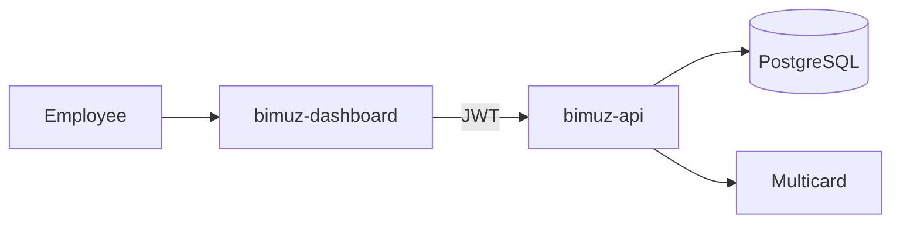
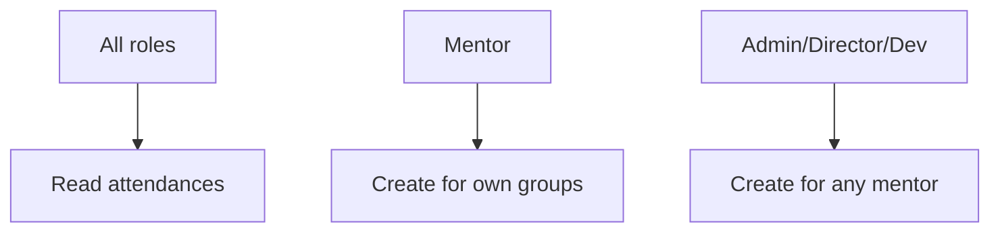

# BIMUZ Dashboard (React)

Admin dashboard for BIMUZ. Implements UI/UX + client-side permission gating, while **all security-critical decisions are enforced by `bimuz-api`**.

## Table of contents

- [Overview](#overview)
- [Role hierarchy & strategy](#role-hierarchy--strategy)
- [Feature modules](#feature-modules)
- [Reports (Hisobotlar)](#reports-hisobotlar)
- [Payments (To‘lovlar)](#payments-tolovlar)
- [Attendances (Davomatlar)](#attendances-davomatlar)
- [Tech stack](#tech-stack)
- [Local development](#local-development)
- [Build & deployment](#build--deployment)
- [Project structure](#project-structure)

## Overview



## Role hierarchy & strategy

### Hierarchy
**Dasturchi > Direktor > Administrator > Buxgalter > (Mentor / Sotuv agenti / Assistent)**

### Strategy used in dashboard
- **All authenticated roles can open all pages (READ)** unless explicitly hidden (e.g. Reports page is intentionally hidden for some roles).
- **Action buttons are gated** using centralized helpers in:
  - `src/lib/permissions.ts`
- **Backend is the source of truth**: UI hiding is convenience only.

### Employees page (Xodimlar) – CRUD rules
- **Dasturchi**: CRUD everyone
- **Direktor**: CRUD everyone **except** Dasturchi (read-only for Dasturchi)
- **Administrator**: CRUD only roles **below Administrator**
- **Buxgalter/Mentor/Sotuv agenti/Assistent**: read-only

## Feature modules

### Employees (Xodimlar)
- Role hierarchy based CRUD UI
- Centralized role assignment restrictions (only assign roles you’re allowed to)

### Students (Talabalar)
- CRUD operations with search/filter/pagination

### Groups (Guruhlar)
- CRUD + mentor assignment + planned groups visibility

## Reports (Hisobotlar)

### Visibility
Reports page is visible only to:
- `dasturchi`, `direktor`, `administrator`, `buxgalter`

### Salary/Payments operations
- Salary update/delete and “paid” marking is restricted to:
  - **Direktor** and **Buxgalter**

### Core business logic (done on backend)
- Mentor split rule:
  - ≤ 6 students: Director 45% / Mentor 55%
  - > 6 students: Director 40% / Mentor 60%
- Director remaining = director share − total non-mentor salaries (never negative)

### Excel export
- Available only for **Buxgalter** (document/accounting workflow).

## Payments (To‘lovlar)

Dashboard Payments page shows **student invoices**.
- If invoice is unpaid → show **To‘lov havolasi**
- If invoice is paid → show **Kvitansiya havolasi**
- No “mark as paid” checkbox in dashboard for student invoices (analytics integrity).

## Attendances (Davomatlar)

- Everyone can read attendances.
- Attendance creation rules:
  - Mentor creates for own groups
  - Dasturchi/Direktor/Administrator can create for any mentor (mentor selection + group list)
  - Planned groups appear but are disabled for creation



## Tech stack

### Core
- **[React 19.2](https://react.dev/)** - UI library
- **[TypeScript 5.9](https://www.typescriptlang.org/)** - Type safety
- **[Vite 7.2](https://vitejs.dev/)** - Build tool and dev server
- **[React Router 7.12](https://reactrouter.com/)** - Client-side routing

### UI Components & Styling
- **[shadcn/ui](https://ui.shadcn.com/)** - Component library
- **[Radix UI](https://www.radix-ui.com/)** - Accessible component primitives
- **[TailwindCSS 4.1](https://tailwindcss.com/)** - Utility-first CSS
- **[Lucide React](https://lucide.dev/)** - Icon library

### State Management & Data Fetching
- **[Zustand 5.0](https://zustand-demo.pmnd.rs/)** - Lightweight state management
- **[Axios 1.13](https://axios-http.com/)** - HTTP client
- **[React Context](https://react.dev/reference/react/useContext)** - Auth context

### Development Tools
- **[ESLint](https://eslint.org/)** - Code linting
- **[TypeScript ESLint](https://typescript-eslint.io/)** - TypeScript linting
- **[pnpm](https://pnpm.io/)** - Package manager

### Deployment
- **[Docker](https://www.docker.com/)** - Containerization
- **[Nginx](https://nginx.org/)** - Web server
- **[GitLab CI/CD](https://docs.gitlab.com/ee/ci/)** - Continuous integration

---

## Local development

Before you begin, ensure you have the following installed:

- **Node.js** >= 20.x
- **pnpm** >= 8.x (recommended) or npm/yarn
- **Docker** >= 24.x (for containerized deployment)
- **Git** (for version control)

---

### Install

### Clone the Repository

```bash
git clone <repository-url>
cd bimuz-dashboard
```

### Install Dependencies

```bash
# Using pnpm (recommended)
pnpm install

# Or using npm
npm install

# Or using yarn
yarn install
```

### Environment variables

Create a `.env` file in the root directory (optional for development):

```env
VITE_API_BASE_URL=http://localhost:8000
```

For production, the API base URL should be set during the Docker build process.

---

## Build & deployment

### Start Development Server

```bash
pnpm dev
```

The application will be available at `http://localhost:5173`

### Available Scripts

```bash
# Start development server
pnpm dev

# Build for production
pnpm build

# Preview production build
pnpm preview

# Run linter
pnpm lint
```

### Development Features

- ⚡ **Hot Module Replacement (HMR)** - Instant updates during development
- 🔍 **TypeScript** - Full type checking and IntelliSense
- 🎨 **TailwindCSS** - Utility-first styling with JIT compilation
- 🧹 **ESLint** - Code quality and consistency

---

## 🏗 Building

### Production Build

```bash
pnpm build
```

The production build will be generated in the `dist/` directory.

### Build Output

```
dist/
├── index.html
├── assets/
│   ├── index-[hash].js
│   └── index-[hash].css
└── ...
```

---

### Docker

### Docker Deployment

#### Build Docker Image

```bash
docker build \
  --build-arg VITE_API_BASE_URL=https://api.yourdomain.com \
  -t bimuz-dashboard:latest .
```

#### Run with Docker Compose

```bash
docker-compose up -d
```

The dashboard will be available at `http://localhost:3000`

#### Docker Compose Configuration

```yaml
services:
  dashboard:
    build:
      context: .
      args:
        VITE_API_BASE_URL: ${VITE_API_BASE_URL:-http://localhost:8000}
    ports:
      - "3000:80"
    restart: unless-stopped
```

### GitLab CI/CD

The project includes GitLab CI/CD configuration for automatic builds and deployments.

#### Build Configuration

The `.gitlab-ci.yml` file automatically:
- Builds Docker images on push
- Pushes images to GitLab Container Registry
- Uses build cache for faster builds

#### Environment Variables

Set the following in GitLab CI/CD Variables:

- `VITE_API_BASE_URL` - API base URL for the frontend

### Production Deployment Steps

1. **Build the image** (or pull from registry):
   ```bash
   docker pull registry.gitlab.com/your-group/bimuz-dashboard:latest
   ```

2. **Run the container**:
   ```bash
   docker run -d \
     -p 3000:80 \
     --name bimuz-dashboard \
     --restart unless-stopped \
     registry.gitlab.com/your-group/bimuz-dashboard:latest
   ```

3. **Or use Docker Compose**:
   ```bash
   docker-compose up -d
   ```

---

## Project structure

```
bimuz-dashboard/
├── public/                 # Static assets
├── src/
│   ├── components/         # React components
│   │   ├── ui/            # shadcn/ui components
│   │   ├── employees/     # Employee-related components
│   │   ├── students/      # Student-related components
│   │   ├── groups/        # Group-related components
│   │   └── ...
│   ├── contexts/          # React contexts
│   │   └── AuthContext.tsx
│   ├── hooks/             # Custom React hooks
│   ├── lib/               # Utility functions
│   │   ├── api.ts        # API client configuration
│   │   └── utils.ts      # Helper functions
│   ├── pages/             # Page components
│   │   ├── Employees.tsx
│   │   ├── Students.tsx
│   │   ├── Groups.tsx
│   │   ├── Payments.tsx
│   │   └── Login.tsx
│   ├── stores/            # Zustand stores
│   │   └── authStore.ts
│   ├── App.tsx            # Main app component
│   └── main.tsx           # Entry point
├── .dockerignore          # Docker ignore file
├── .gitignore            # Git ignore file
├── .gitlab-ci.yml        # GitLab CI/CD configuration
├── Dockerfile            # Docker image definition
├── docker-compose.yml    # Docker Compose configuration
├── index.html            # HTML template
├── package.json          # Dependencies and scripts
├── pnpm-lock.yaml        # Lock file
├── tsconfig.json         # TypeScript configuration
├── vite.config.ts        # Vite configuration
└── README.md             # This file
```

---

## Configuration

### API Configuration

The API base URL can be configured in several ways:

1. **Environment Variable** (development):
   ```env
   VITE_API_BASE_URL=http://localhost:8000
   ```

2. **Build Argument** (Docker):
   ```bash
   docker build --build-arg VITE_API_BASE_URL=https://api.example.com .
   ```

3. **Docker Compose**:
   ```yaml
   environment:
     - VITE_API_BASE_URL=https://api.example.com
   ```

### Authentication

The dashboard uses JWT-based authentication:
- Access tokens are stored in memory (Zustand store)
- Refresh tokens are stored in localStorage
- Automatic token refresh on 401 errors
- Automatic logout on refresh failure

---

## Notes

- **Internal navigation** uses `react-router-dom` `Link` components (no full page reload).
- UI permissions are centralized in `src/lib/permissions.ts`, but backend must still validate everything.